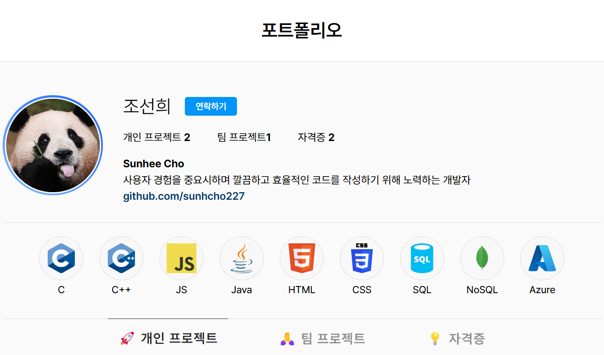
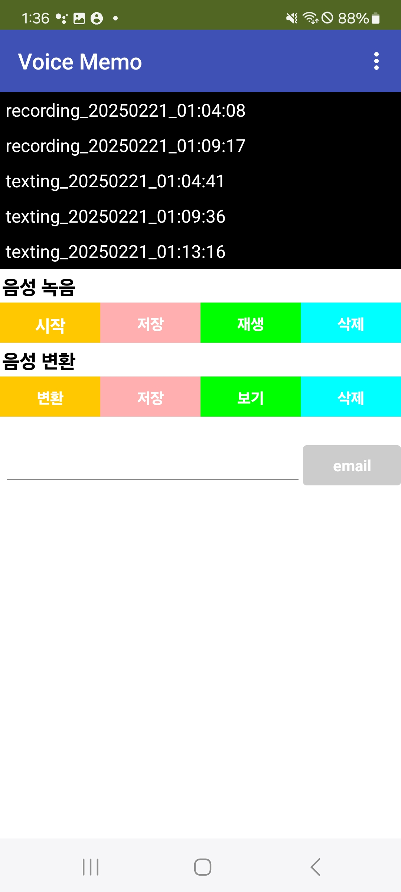
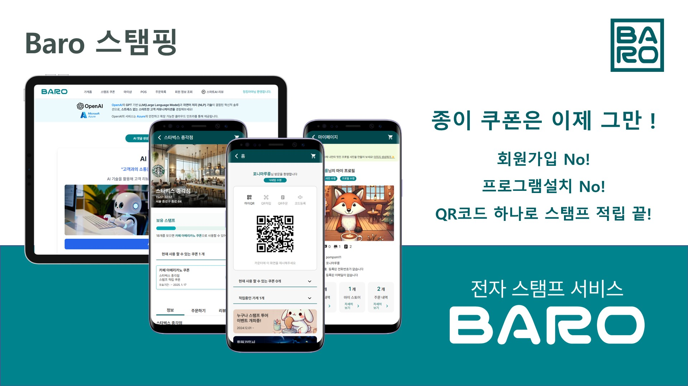

# 👩‍💻 조선희 개발자 포트폴리오



## 📫 Link to

- **Homepage**: https://sunhcho227.github.io/MyPortfolio/
- **Notion**: https://chestnut-fiber-71d.notion.site/My-Portfolio-1b212efc9e2b80489e2ce54ceb07dc5c
- **이메일**: ihateundefined@gmail.com
- **GitHub**: [github.com/sunhcho227](https://github.com/sunhcho227)

## 소개 👋

안녕하세요! **사용자 경험을 중요시하며 깔끔하고 효율적인 코드를 작성하기 위해 노력하는 개발자 조선희**입니다.

이 레포지토리는 제 개발 역량과 프로젝트 경험을 소개하는 포트폴리오 웹사이트를 담고 있습니다. 인스타그램과 슬랙에서 영감을 받아 디자인했으며, HTML, CSS, JavaScript를 활용하여 반응형 웹사이트로 구현했습니다.

## 📚 기술 스택

<div style="display: flex; gap: 10px;">
  
  
  
  
  
  
  
  
  
  
</div>

## 🌟 구현 세부사항
### 💅 디자인
- **Pretendard** 폰트를 기본으로 적용하여 가독성 높은 디자인
- 인스타그램 스타일의 프로필 레이아웃
- 스킬 로고에 호버 이펙트 적용
- 반응형 웹 디자인으로 모바일 환경 지원

### 🔧 기능
- 이메일 연락 버튼: 클릭 시 Gmail 작성 페이지로 연결
- 탭 전환 기능: 개인 프로젝트, 팀 프로젝트, 자격증 섹션 간 전환
- 스크롤 기반 이미지 전환: 스크롤 위치에 따라 우측 이미지가 변경되는 인터랙티브 기능
- 스킬 로고: 해당 기술 페이지로 연결되는 인터랙티브 아이콘

## 🚀 프로젝트

### 1. All About Voice


App Inventor로 개발한 음성 어플리케이션으로, 음성 녹음, STT(Speech-to-Text) 및 이메일 발송 기능을 원스톱으로 제공합니다.

**사용 기술:**
- APP Inventor

**주요 기능:**
- 음성 녹음 및 저장
- 음성을 텍스트로 변환(STT)
- 변환된 텍스트 이메일 발송

**[노션에서 자세히 보기](https://chestnut-fiber-71d.notion.site/All-About-Voice-1a112efc9e2b8034a470ec6605461a80#1a112efc9e2b81058fb1e063be336b61)**

### 2. My Portfolio


인스타그램과 슬랙의 UI/UX를 참고하여 제작한 개인 포트폴리오 웹사이트입니다. 

**사용 기술:**
- HTML5
- CSS3
- JavaScript

**특징:**
- 반응형 디자인
- 스크롤 기반 인터랙티브 이미지 전환
- 모던 UI 디자인
- 사용자 친화적 레이아웃

**[노션에서 자세히 보기](https://chestnut-fiber-71d.notion.site/My-Portfolio-1b212efc9e2b80489e2ce54ceb07dc5c)**

### 3. Baro Stamping


JS Framework Meteor 기반으로 개발한 전자 스탬프 서비스입니다.

**사용 기술:**
- JavaScript
- React
- HTML5
- CSS3
- TailwindCSS
- AWS MongoDB
- Azure Blob Storage
- Meteor

**주요 기능:**
- 전자 스탬프 생성 및 관리
- 사용자 인증 시스템
- 스탬프 적립 및 사용 기능

**[GitHub 저장소](https://github.com/sunhcho227/BaroStampingLocal)**

## 🔮 다음 프로젝트
저의 다음 프로젝트가 곧 공개됩니다! 기대해 주세요.

## 🎓 자격증
- 정보처리기사 필기 !!
- ADsP

## 📂 프로젝트 폴더 구조

```markdown
MyPortfolio/
├── sources/
│   ├── allAboutVoice.jpg
│   ├── baroStamping.jpg
│   ├── myPortfolio.png
│   ├── comingSoon.webp
│   ├── favicon.png
├── README.md
├── index.html
├── styles.css
├── scripts.js
```

---

✨ 더 나은 사용자 경험과 효율적인 개발을 위해 항상 배우고 성장하는 개발자가 되겠습니다! ✨
